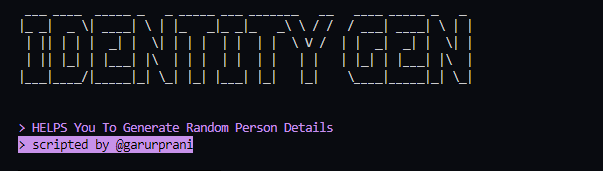
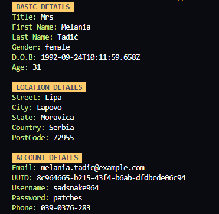

# IdentityGEN
IdentityGEN utilizes the randomuser.me API to instantly produce realistic and varied random person data, including names, genders, dates of birth, locations, email addresses, login credentials, and phone numbers. Perfect for testing and placeholder data needs.

<h2>Screenshots</h2>
    <table>
        <tr>
            <td>
                
                
Main Menu

            </td>
            <td>
                
                
Adding a New Student

            </td>
        </tr>
        </tr>
    </table>

   <h2>Features</h2>
    <ul>
        <li>Generates realistic random person data</li>
        <li>Includes names, genders, dates of birth, locations (street, city, state, country), email addresses, login credentials (username, password), and phone numbers</li>
        <li>Useful for testing, simulation, or generating placeholder data</li>
    </ul>
    
   <h2>API used</h2>
    
To craft IdentityGEN, I have used <a href="https://randomuser.me/api" target="_blank">randomuser.me</a> API

    
  <h2>Installation</h2>
    <ol>
        <li>Clone the repository from GitHub:</li>
        <pre><code>git clone https://github.com/your-username/identitygen.git</code></pre>
        
   <li>Navigate into the project directory:</li>
        <pre><code>cd identitygen</code></pre>
        
  <li>Install dependencies using pip (make sure you have Python installed):</li>
        <pre><code>pip install -r requirements.txt</code></pre>
    </ol>
    
   <h2>License</h2>
    
This project is licensed under the MIT License. See the <a href="LICENSE" target="_blank">LICENSE</a> file for more details.

    
   <h2>Contributing</h2>
    
Contributions are welcome! Fork the repository, make your changes, and submit a pull request.

    
   <h2>Support</h2>
    
For any questions or issues, please <a href="https://github.com/your-username/identitygen/issues" target="_blank">create an issue</a> on GitHub.

    
  <h2>Author</h2>
    
Created by Garur Prani

    
   <footer>
        
&copy; 2024 IdentityGEN. Released under the <a href="LICENSE" target="_blank">MIT License</a>.

    </footer>
</body>
</html>
